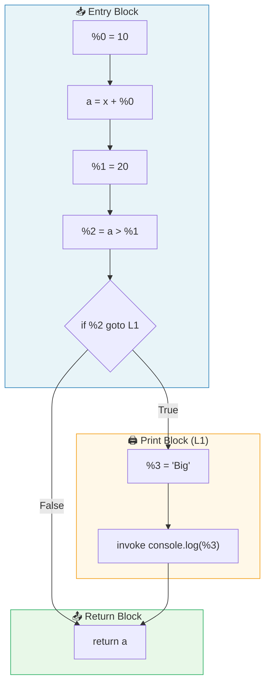
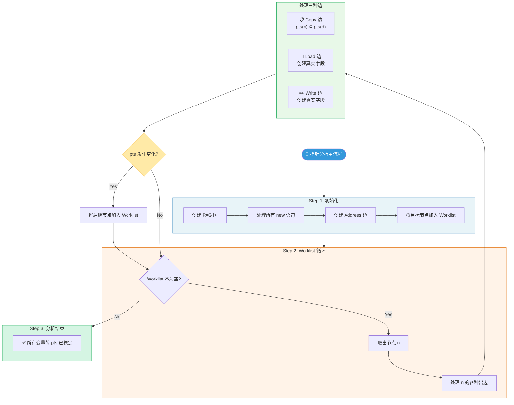
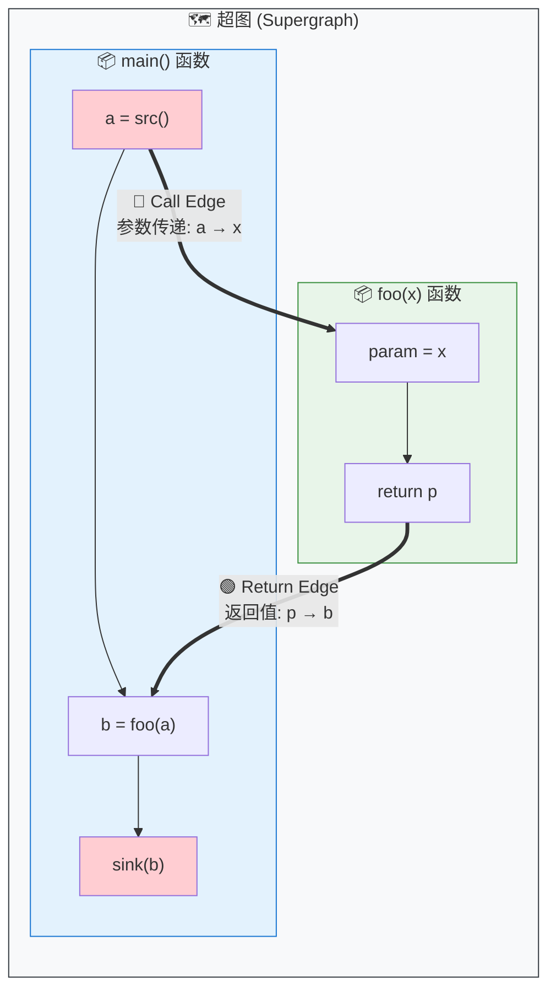
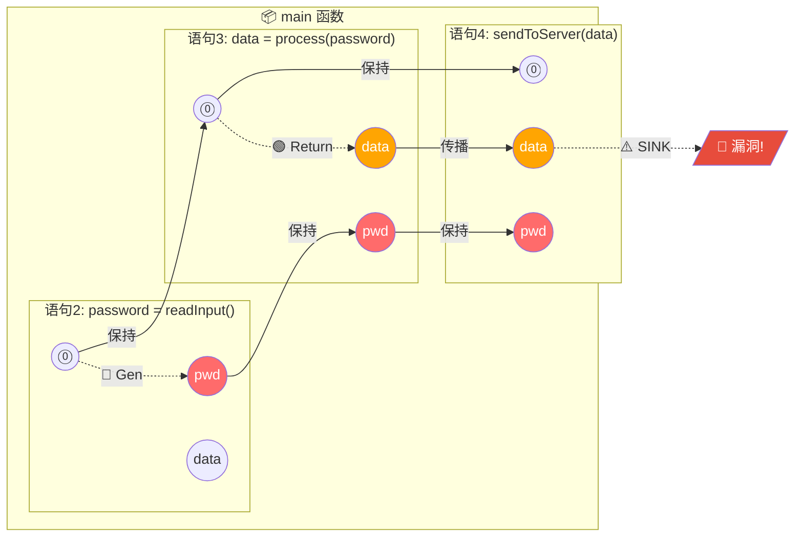
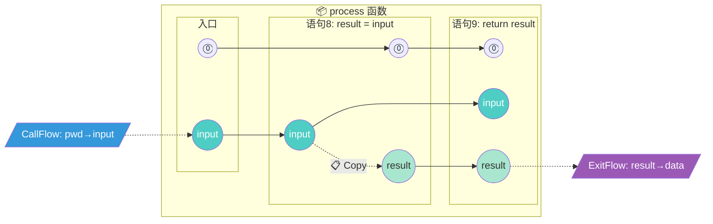
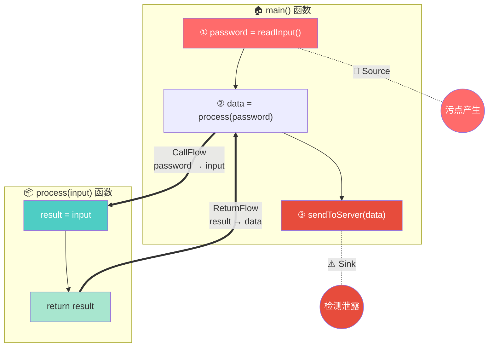
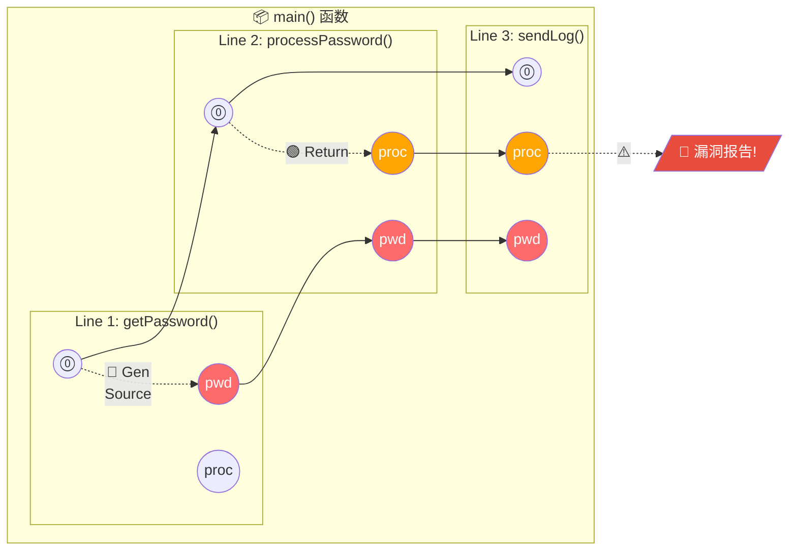
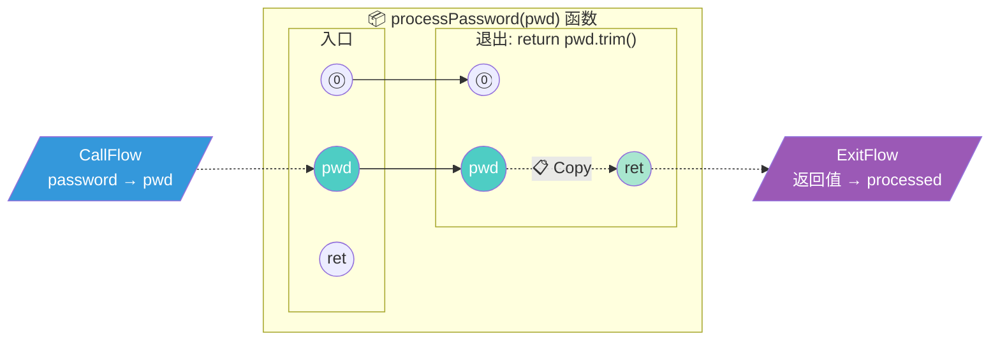
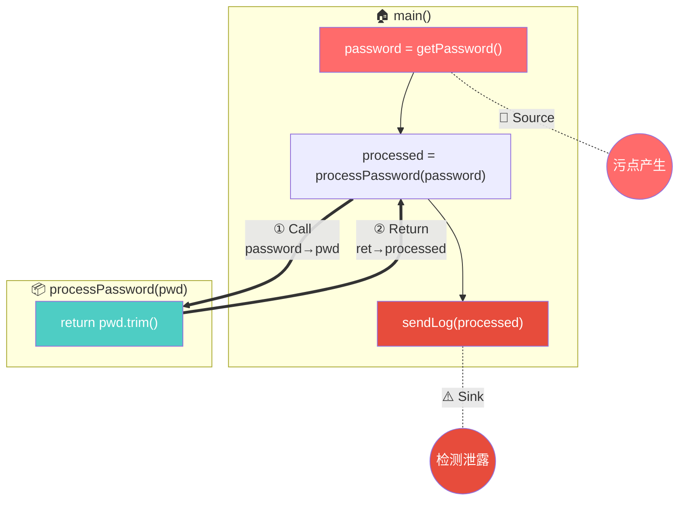

# ArkAnalyzer 技术解析与实战指南

---

## 目录

- [一、引言：ArkAnalyzer 是如何"看"代码的](#一引言arkanalyzer-是如何看代码的)
- [二、核心基石：ArkIR 与控制流图 (CFG)](#二核心基石arkir-与控制流图-cfg)
 - [三、导航图：调用图构建 (Call Graph)](#三导航图调用图构建-call-graph)
- [四、核心引擎一：指针分析 (Pointer Analysis)](#四核心引擎一指针分析-pointer-analysis)
- [五、核心引擎二：IFDS 数据流分析 (重点详解)](#五核心引擎二ifds-数据流分析-重点详解)
- [六、污点流分析 (Taint Analysis) 深度实战](#六污点流分析-taint-analysis-深度实战)
- [七、其他分析能力：ArkAnalyzer 的完整武器库](#七其他分析能力arkanalyzer-的完整武器库)
- [八、生命周期建模：DummyMain 机制 (详解)](#八生命周期建模dummymain-机制-详解)
- [九、总结：ArkAnalyzer 的完整分析管线](#九总结arkanalyzer-的完整分析管线)

---

## 一、引言：ArkAnalyzer 是如何"看"代码的

想象你是一台 X 光机，医生用你看病人的身体结构，而 **ArkAnalyzer** 用来看代码的"内部骨架"。

*   **编译器 (Compiler)** 关注的是"如何把代码翻译成机器能跑的指令"。
*   **ArkAnalyzer (静态分析器)** 关注的是"代码在这个位置**可能**会发生什么？变量**可能**变成什么值？"

它不运行代码，而是通过**数学建模**来推演代码的所有可能性。

---

## 二、核心基石：ArkIR 与控制流图 (CFG)

ArkAnalyzer 不直接分析你写的 TypeScript/ArkTS 代码，因为它太复杂了（各种语法糖）。它先把代码变成一种超级简单的形式，叫 **ArkIR (Intermediate Representation)**，也就是**中间表示**。

### 2.1 ArkIR 详解：代码的"原子"形态

ArkIR 是一种 **三地址码 (3-Address Code)** 的变体。它的核心思想是：**把复杂的嵌套表达式拆解成最基本的指令**。

在 ArkAnalyzer 的源码 (`src/core/base/Stmt.ts` 和 `Expr.ts`) 中，定义了以下核心指令：

#### 2.1.1 核心语句 (Statements)

语句是控制流的基本单位，它们构成了 CFG 的节点。

| 语句类型 | 类名 (源码) | 示例代码 (ArkIR) | 说明 |
| :--- | :--- | :--- | :--- |
| **赋值** | `ArkAssignStmt` | `a = b` 或 `x = 10` | 数据的移动或计算结果的存储 |
| **调用** | `ArkInvokeStmt` | `invoke func(%0)` | 函数调用，不接收返回值 (或忽略) |
| **条件跳转** | `ArkIfStmt` | `if %1 == true goto L1` | 控制流的分叉，只接受简单的条件 |
| **返回** | `ArkReturnStmt` | `return %2` | 函数结束并返回值 |
| **抛出异常** | `ArkThrowStmt` | `throw %3` | 异常控制流 |
| **类型别名** | `ArkAliasTypeDefineStmt` | `type A = string` | TS 特有的类型定义保留 |

#### 2.1.2 核心表达式 (Expressions)

表达式依附于语句，描述具体的数据操作。

| 表达式类型 | 类名 (源码) | 示例 | 含义 |
| :--- | :--- | :--- | :--- |
| **对象创建** | `ArkNewExpr` | `new Dog` | 在堆上分配内存 |
| **数组创建** | `ArkNewArrayExpr` | `newarray (number)[10]` | 分配数组空间 |
| **实例调用** | `ArkInstanceInvokeExpr` | `instanceinvoke x.<m>()` | 调用对象的方法 (需查虚表) |
| **静态调用** | `ArkStaticInvokeExpr` | `staticinvoke <C.m>()` | 调用静态方法或全局函数 |
| **字段读取** | `ArkInstanceFieldRef` | `x.f` | 读取对象字段 |
| **二元运算** | `ArkBinopExpr` | `a + b`, `a > b` | 加减乘除、逻辑比较 |
| **类型转换** | `ArkCastExpr` | `<string>x` | 强制类型转换 |

### 2.2 实战：源码到 IR 的转换对照

让我们看一个更复杂的例子，包含对象创建和方法调用：

**源代码 (TypeScript):**
```typescript
class Wrapper {
    value: number;
    constructor(v: number) { this.value = v; }
}

function compute(list: Wrapper[]): number {
    let sum = 0;
    if (list.length > 0) {
        let w = list[0];
        sum = sum + w.value;
    }
    return sum;
}
```

**ArkIR (中间表示):**
*注意：数组访问、属性读取都被显式化了*

```typescript
function compute(list) {
    // 1. 初始化 sum
    sum = 0
    
    // 2. 获取 length 属性 (隐式字段读取)
    %0 = list.length
    
    // 3. 条件判断
    if %0 > 0 goto Label_Process
    goto Label_Return

Label_Process:
    // 4. 数组读取 (ArrayRef)
    %1 = list[0]
    w = %1
    
    // 5. 字段读取 (InstanceFieldRef)
    %2 = w.value
    
    // 6. 加法运算
    sum = sum + %2
    
    goto Label_Return

Label_Return:
    return sum
}
```

### 2.3 图解：控制流图 (CFG) 结构

有了 ArkIR，我们就可以构建 **控制流图 (CFG)**。
CFG 把代码切成一个个 **基本块 (Basic Block)**，块内部是顺序执行的，块之间通过跳转连接。



**ArkAnalyzer 中的对应代码：**
*   `src/core/graph/Cfg.ts`: 定义了图结构。
*   `src/core/graph/BasicBlock.ts`: 定义了图中的方框（块）。

---

## 三、导航图：调用图构建 (Call Graph)

在分析整个项目时，我们需要一张地图，告诉我们函数 A 调用了函数 B，函数 B 又调用了函数 C。这就是 **调用图 (Call Graph)**。

### 3.1 CHA vs RTA vs PTA：精准度的较量

构建这张地图有三种主要算法，它们的区别在于**"有多敢猜"**。

#### 算法 1: CHA (Class Hierarchy Analysis) - 类层次分析
*   **核心逻辑** (`ClassHierarchyAnalysis.ts`): 
    *   当遇到 `o.method()` 调用时，CHA 只看 `o` 的**声明类型**。
    *   它会遍历该类型的所有**子类**，只要子类里有这个方法，就认为可能会被调用。
*   **优缺点**: 速度极快，但非常不准。比如定义了 `Animal a`，即使你只 `new Dog()`，它也会认为 `Cat.speak()` 被调用了。

#### 算法 2: RTA (Rapid Type Analysis) - 快速类型分析
*   **核心逻辑** (`RapidTypeAnalysis.ts`):
    *   RTA 比 CHA 聪明在它会**记录哪些类被实例化了**。
    *   它维护一个 `instancedClasses` 集合。
    *   在解析调用时，它先像 CHA 一样找所有子类，但会**过滤掉**那些从未被 `new` 过的类。
*   **优缺点**: 比 CHA 准，能排除掉大量未使用的类代码。但如果代码里有 `if(false) new Cat()`，RTA 还是会被骗。

#### 算法 3: PTA (Pointer Analysis) - 指针分析
*   **核心逻辑**:
    *   这是最精准的方法。它不看类型，而是看**数据流**。
    *   它计算 `o` 变量在运行时到底指向了哪个对象（通过 `Alloc` 节点追踪）。
    *   ArkAnalyzer 主要依赖这种方式来构建高精度的调用图。

---

## 四、核心引擎一：指针分析 (Pointer Analysis)

这是 ArkAnalyzer 最复杂也最核心的部分，代码主要位于 `src/callgraph/pointerAnalysis`。

### 4.1 通俗理解：它在算什么？

指针分析就是解决一个问题：**这个变量到底指向内存里的哪块地？**

ArkAnalyzer 使用的是 **Andersen 指针分析** 算法，这是一种**基于包含约束 (Inclusion-based)** 的分析方法。
简单来说，就是处理 `A = B` 这样的语句，意味着 `B` 指向的所有东西，`A` 也能指向（即 `pts(B) ⊆ pts(A)`）。

### 4.2 PAG 图解：搭建信息高速公路

为了算出结果，ArkAnalyzer 会构建一个 **PAG (Pointer Assignment Graph)**。PAG 中的节点 (`PagNode`) 代表程序中的各种元素。

**PAG 节点的七十二变 (`PagNodeKind`):**

| 节点类型 | 源码类名 | 含义 |
| :--- | :--- | :--- |
| **LocalVar** | `PagLocalNode` | 局部变量 (如 `x`, `y`) |
| **HeapObj** | `PagNewExprNode` | `new` 出来的对象 (内存分配点) |
| **Field** | `PagInstanceFieldNode` | 对象的字段 (如 `x.f`) |
| **StaticField** | `PagStaticFieldNode` | 静态字段 (如 `Class.f`) |
| **Param** | `PagParamNode` | 函数参数 |
| **This** | `PagThisRefNode` | `this` 指针 |
| **Array** | `PagArrayNode` | 数组元素抽象 |

**PAG 边的类型与流向:**

| 代码 | PAG 边类型 | 流向 | 含义 |
| :--- | :--- | :--- | :--- |
| `x = new A()` | **Address** | `Alloc_A -> x` | `x` 指向 `Alloc_A` (初始事实) |
| `y = x` | **Copy** | `x -> y` | `x` 的指向集流入 `y` |
| `y = x.f` | **Load** | `x.f -> y` | 从堆读取数据到栈变量 |
| `x.f = z` | **Write** | `z -> x.f` | 从栈变量写入数据到堆 |

### 4.3 算法流程图解 (Worklist Algorithm)

ArkAnalyzer 使用 **工作列表 (Worklist)** 算法来不断推导，直到结果稳定（不动点）。



### 4.4 重点难点：动态字段处理 (`handleLoadWrite`)

这是指针分析最难懂的地方。
当分析器看到 `y = x.f` 时，它**不知道** `x` 指向什么。
只有当 `x` 的指向集 (`pts(x)`) 更新时（比如发现 `x` 指向 `Obj1` 和 `Obj2`），分析器才会动态地去更新 PAG 图：
1.  找到或创建 `Obj1.f` 节点，添加边 `Obj1.f --Copy--> y`。
2.  找到或创建 `Obj2.f` 节点，添加边 `Obj2.f --Copy--> y`。

这也是为什么 `src/callgraph/pointerAnalysis/PointerAnalysis.ts` 中 `handleLoadWrite` 方法逻辑如此复杂的原因。

---

## 五、核心引擎二：IFDS 数据流分析 (重点详解)

如果说指针分析是确定"谁指向谁"，那 IFDS 就是确定"谁被谁污染了"。
这是一个非常重要且精妙的算法，让我们用大量篇幅来彻底搞懂它。

### 5.1 什么是 IFDS？名字的含义

**IFDS** 全称是 **Interprocedural Finite Distributive Subset Problem**，翻译过来是"过程间有限分配子集问题"。

让我们拆解这个名字：
*   **Interprocedural (过程间)**：能跨函数分析，不仅仅看单个函数内部。
*   **Finite (有限)**：分析的"事实"集合是有限的（比如程序中的变量数量是有限的）。
*   **Distributive (分配)**：分析操作满足分配律，这是数学上的一个性质，保证了算法的正确性。
*   **Subset (子集)**：我们关心的是"哪些事实成立"，本质上是在求一个集合。

**代码位置**：`src/core/dataflow/DataflowSolver.ts`

### 5.2 它能解决什么问题？

IFDS 专门用来解决**"可达性"**问题，最典型的应用场景包括：

| 应用场景 | 问题描述 | 事实 (Fact) 的定义 |
| :--- | :--- | :--- |
| **污点分析** | 用户输入是否流向了危险函数？ | "变量 x 被污染" |
| **未初始化变量检测** | 是否有变量在赋值前被使用？ | "变量 x 未初始化" |
| **空指针检测** | 是否在空指针上调用了方法？ | "变量 x 可能为 null" |
| **常量传播** | 变量的值在某点是否为常量？ | "变量 x 的值为 5" |
| **除零检测** | 是否存在除以零的风险？ | "变量 x 可能为 0" |

### 5.3 核心原理：把代码变成一张巨大的图

#### 5.3.1 第一步：理解"超图" (Supergraph)

首先，IFDS 会把整个程序的所有函数的 CFG 连接起来，形成一张大图，叫**超图**。



> **超图的核心思想**：把所有函数的 CFG 用 **Call Edge（调用边）** 和 **Return Edge（返回边）** 连接起来，形成一张跨函数的大图。

#### 5.3.2 第二步：理解"爆炸" (Exploded)

普通的 CFG 一个节点就是一行代码。但在 IFDS 中，我们要追踪**每个变量在每个位置的状态**。

所以，**一行代码被分裂成了 N+1 个节点**：
*   N = 程序中可追踪的"事实"数量（比如所有变量）
*   +1 是一个特殊的 **"零事实" (0)**，表示"什么都没发生"

**举例：污点分析**

假设程序有 3 个变量 `a, b, c`，每行代码会被炸成 4 个节点：`(stmt, 0)`, `(stmt, a)`, `(stmt, b)`, `(stmt, c)`

### 5.4 完整举例：手把手走一遍污点分析

让我们用一个完整的例子，**逐步演示** IFDS 是如何工作的。

#### 5.4.1 待分析代码

```typescript
1.  function main() {
2.      let password = readInput();  // Source: 用户输入，产生污点
3.      let data = process(password);
4.      sendToServer(data);           // Sink: 发送到网络，危险！
5.  }
6.
7.  function process(input) {
8.      let result = input;           // 污点传播
9.      return result;
10. }
```

**问题**：`password` 的污点是否会流到 `sendToServer` 的参数？

#### 5.4.2 爆炸超图的构建

我们追踪的事实集合是：`{⓪, password, data, input, result}`

> **什么是爆炸超图？** 把每条语句"炸开"成多个节点，每个节点代表 `(语句, 事实)` 的组合。边表示事实如何从一个位置传播到另一个位置。

**🔵 主函数 (main) 的爆炸超图：**



**🟢 process() 函数的爆炸超图：**



**🔗 两个函数之间的连接关系：**



**📖 图例说明**：

| 符号 | 含义 |
|------|------|
| `⓪` | 特殊的"零事实"，始终成立，用于追踪基本可达性 |
| 🔴 红色节点 | 变量 `password` 被污染 |
| 🟠 橙色节点 | 变量 `data` 被污染（从 `password` 间接传播） |
| 🟢 绿色节点 | `process` 函数内部的污点状态 |
| **Gen** | 污点产生（`readInput()` 是 Source） |
| **CallFlow** | 调用时：实参 `password` → 形参 `input` |
| **ReturnFlow** | 返回时：返回值 `result` → 接收变量 `data` |
| **Copy** | 赋值语句导致的污点复制 |

#### 5.4.3 IFDS 求解过程 (Step by Step)

**初始状态**：
```
WorkList = [ PathEdge<(main入口, 0), (main入口, 0)> ]  // 起点
```

**第 1 轮：处理 main 入口**
```
取出: PathEdge<(main入口, 0), (main入口, 0)>
当前语句: let password = readInput();
应用 NormalFlow:
  - (0) 产生 (password)，因为 readInput() 是 Source！
新增: PathEdge<(main入口, 0), (语句2, password)>
新增: PathEdge<(main入口, 0), (语句2, 0)>
```

**第 2 轮：处理语句 2 的输出**
```
取出: PathEdge<(main入口, 0), (语句2, password)>
当前语句: let data = process(password);
这是一个 Call 语句！
应用 CallFlow (main -> process):
  - password 映射到 process 的参数 input
新增: PathEdge<(process入口, input), (process入口, input)>
应用 CallToReturn:
  - password 保持 (它不会因为调用而消失)
新增: PathEdge<(main入口, 0), (语句3, password)>
```

**第 3 轮：分析 process 函数**
```
取出: PathEdge<(process入口, input), (process入口, input)>
当前语句: let result = input;
应用 NormalFlow:
  - input 赋值给 result，产生 (result)
新增: PathEdge<(process入口, input), (语句8, result)>

继续到 return result:
应用 ExitFlow:
  - result 映射回调用点的 data
记录 SummaryEdge: (process入口, input) -> (语句3, data)
```

**第 4 轮：返回 main 函数**
```
应用 SummaryEdge:
新增: PathEdge<(main入口, 0), (语句3, data)>
```

**第 5 轮：到达 Sink**
```
取出: PathEdge<(main入口, 0), (语句3, data)>
当前语句: sendToServer(data);
data 被污染，且 sendToServer 是 Sink！
⚠️ 报告漏洞！
```

#### 5.4.4 结论

IFDS 发现了从 `(语句2, password)` 到 `(语句4, data)` 的可达路径，证明了污点会从 `readInput()` 流向 `sendToServer()`。

### 5.5 核心数据结构详解

在 `src/core/dataflow` 目录中，定义了以下关键数据结构：

#### 5.5.1 PathEdge (路径边) - `Edge.ts`

```typescript
// 路径边的一个端点
class PathEdgePoint<D> {
    node: Stmt;  // 程序中的语句
    fact: D;     // 数据事实 (如 "变量a被污染")
}

// 路径边本身
class PathEdge<D> {
    edgeStart: PathEdgePoint<D>;  // 起点 (通常是函数入口)
    edgeEnd: PathEdgePoint<D>;    // 终点 (当前分析到的位置)
}
```

**含义**：`PathEdge<d1, d2>` 表示"**如果**函数入口处事实 d1 成立，**那么**在当前位置事实 d2 成立"。

#### 5.5.2 Summary Edge (摘要边)

摘要边是 IFDS 高效的秘密武器。它缓存了函数的分析结果：

```
SummaryEdge = {
    入口事实 (input) -> 出口事实 (output)
}
```

**例子**：
```
process 函数的摘要边:
  (入口, input) -> (出口, result)
  
含义: 如果调用 process 时参数被污染，返回值也会被污染
```

当下次遇到 `process()` 调用时，**不需要再次进入函数体分析**，直接查表即可！

### 5.6 四种传播函数详解

在 `DataflowProblem.ts` 中定义了四种函数，告诉求解器如何传播事实：

| 函数名 | 触发场景 | 作用 | 代码示例 |
| :--- | :--- | :--- | :--- |
| **getNormalFlowFunction** | 普通语句 | 语句内传播 | `a = b` → 若 b 脏则 a 脏 |
| **getCallFlowFunction** | 函数调用 | 实参 → 形参 | `foo(x)` → x 映射到 param |
| **getExitToReturnFlowFunction** | 函数返回 | 返回值 → 接收变量 | `return r` → r 映射到 res |
| **getCallToReturnFlowFunction** | 调用语句 | 跨调用保持 | 调用不影响的局部变量 |

### 5.7 IFDS 求解器流程图

```
┌─────────────────────────────────────────────────────────────────┐
│                      IFDS 求解器主循环                          │
└─────────────────────────────────────────────────────────────────┘
                              │
                              ▼
              ┌───────────────────────────────┐
              │ 初始化 WorkList               │
              │ 加入入口边 <(entry,0),(entry,0)> │
              └───────────────────────────────┘
                              │
                              ▼
              ┌───────────────────────────────┐
              │ while (WorkList 不为空)        │◄─────────────────┐
              │     取出 PathEdge e           │                  │
              └───────────────────────────────┘                  │
                              │                                   │
         ┌────────────────────┼────────────────────┐              │
         │                    │                    │              │
         ▼                    ▼                    ▼              │
┌─────────────────┐  ┌─────────────────┐  ┌─────────────────┐    │
│ e.end 是普通语句 │  │ e.end 是调用语句 │  │ e.end 是退出语句 │    │
│                 │  │                 │  │                 │    │
│ 应用 NormalFlow │  │ 应用 CallFlow   │  │ 应用 ExitFlow   │    │
│ 传播到后继语句   │  │ 进入被调函数    │  │ 记录 EndSummary │    │
│                 │  │ + CallToReturn  │  │ 回到调用点       │    │
└────────┬────────┘  └────────┬────────┘  └────────┬────────┘    │
         │                    │                    │              │
         │                    │  ┌─────────────────┘              │
         │                    │  │                                │
         │                    ▼  ▼                                │
         │           ┌─────────────────┐                          │
         │           │ 检查 SummaryEdge │                          │
         │           │ 如有缓存，直接用 │                          │
         │           └─────────────────┘                          │
         │                    │                                   │
         └────────────────────┴───────────────────────────────────┘
                              │
                              │ 新边加入 WorkList
                              │
                              ▼
              ┌───────────────────────────────┐
              │ WorkList 为空，分析结束        │
              │ 检查是否存在 Source → Sink 路径 │
              └───────────────────────────────┘
```

### 5.8 为什么 IFDS 高效？

1.  **Summary Edge 缓存**：函数只分析一次，结果复用
2.  **按需分析**：只分析从入口可达的代码
3.  **图可达性**：最终问题转化为图搜索，复杂度可控

---

## 六、污点流分析 (Taint Analysis) 深度实战

污点分析是 IFDS 最重要的应用之一。本章将详细介绍如何用 ArkAnalyzer 实现污点分析。

### 6.1 什么是污点分析？

**污点分析**是一种追踪数据流的技术，用于检测敏感数据是否可能泄露到不安全的地方。

**核心概念：**

| 术语 | 英文 | 含义 | 例子 |
| :--- | :--- | :--- | :--- |
| **Source (源)** | Source | 敏感数据的**产生点** | 用户输入、密码读取、GPS 定位 |
| **Sink (汇)** | Sink | 敏感数据的**危险消费点** | 网络发送、日志打印、文件写入 |
| **Propagation (传播)** | Propagation | 污点如何**流动** | 赋值、函数参数传递、返回值 |
| **Sanitizer (净化器)** | Sanitizer | 消除污点的**清洗点** | 数据验证、加密、脱敏 |

**安全漏洞示例：**

```typescript
// ❌ 危险代码：密码泄露到日志
function handleLogin(username: string, password: string) {
    console.log("Login attempt: " + password);  // Source -> Sink!
    // ...
}

// ❌ 危险代码：用户输入直接拼接 SQL
function queryUser(userInput: string) {
    let sql = "SELECT * FROM users WHERE name = '" + userInput + "'";
    database.execute(sql);  // SQL 注入风险！
}
```

### 6.2 污点分析的工作原理

**流程图：**

```
┌─────────────────────────────────────────────────────────────────┐
│                        污点分析流程                              │
└─────────────────────────────────────────────────────────────────┘
                              │
                              ▼
                    ┌─────────────────────┐
                    │ Step 1: 识别 Source │
                    │ (哪些函数产生污点)  │
                    └─────────────────────┘
                              │
                              │ 例如: readInput(), getPassword()
                              ▼
                    ┌─────────────────────┐
                    │ Step 2: 追踪传播    │
                    │ (污点如何流动)      │
                    └─────────────────────┘
                              │
                              │ 赋值、函数调用、返回值...
                              ▼
                    ┌─────────────────────┐
                    │ Step 3: 检查 Sink   │
                    │ (污点是否到达危险点)│
                    └─────────────────────┘
                              │
              ┌───────────────┴───────────────┐
              ▼                               ▼
    ┌─────────────────────┐       ┌─────────────────────┐
    │ 经过 Sanitizer      │       │ 直接到达 Sink       │
    │ ✅ 安全             │       │ ⚠️ 报告漏洞！       │
    └─────────────────────┘       └─────────────────────┘
```

### 6.3 ArkAnalyzer 中的实现

在 ArkAnalyzer 中，污点分析通过 **继承 `DataflowProblem` 类** 来实现。

#### 6.3.1 定义污点分析问题

```typescript
// 污点分析的 "Fact" 就是 Local (局部变量)
// 如果一个 Local 出现在 PathEdge 中，说明它被污染了
class TaintAnalysisProblem extends DataflowProblem<Local> {
    
    // 定义 Source: 哪些方法会产生污点
    private sources: Set<MethodSignature> = new Set([
        // 用户输入
        parseSignature("getUserInput()"),
        parseSignature("readPassword()"),
        // 敏感数据读取
        parseSignature("getLocation()"),
        parseSignature("getContacts()"),
    ]);
    
    // 定义 Sink: 哪些方法是危险的消费点
    private sinks: Set<MethodSignature> = new Set([
        // 网络操作
        parseSignature("sendToServer()"),
        parseSignature("httpPost()"),
        // 日志
        parseSignature("console.log()"),
        // 文件操作
        parseSignature("writeFile()"),
    ]);
    
    // 零值：表示 "什么都没发生" 的特殊事实
    createZeroValue(): Local {
        return new Local("@taint_zero");
    }
}
```

#### 6.3.2 实现四种传播函数

**1. Normal Flow Function (普通语句传播):**

```typescript
getNormalFlowFunction(srcStmt: Stmt, tgtStmt: Stmt): FlowFunction<Local> {
    const analyzer = this;
    return {
        getDataFacts(dataFact: Local): Set<Local> {
            const result = new Set<Local>();
            
            // 规则1: 零值始终传播
            if (dataFact === analyzer.createZeroValue()) {
                result.add(dataFact);
                
                // Source 检查: 如果调用了 Source 函数
                if (srcStmt instanceof ArkAssignStmt) {
                    const rightOp = srcStmt.getRightOp();
                    if (rightOp instanceof AbstractInvokeExpr) {
                        if (analyzer.isSource(rightOp.getMethodSignature())) {
                            // 产生新污点！
                            const taintedVar = srcStmt.getLeftOp() as Local;
                            result.add(taintedVar);
                        }
                    }
                }
                return result;
            }
            
            // 规则2: 赋值传播 a = b
            if (srcStmt instanceof ArkAssignStmt) {
                const leftOp = srcStmt.getLeftOp() as Local;
                const rightOp = srcStmt.getRightOp();
                
                // 如果右值是被污染的变量，左值也被污染
                if (rightOp === dataFact) {
                    result.add(leftOp);
                }
                
                // 如果不是被覆盖的变量，保持原有污点
                if (leftOp !== dataFact) {
                    result.add(dataFact);
                }
                
                // Sink 检查
                if (this.isSinkCall(srcStmt) && this.isArgument(dataFact, srcStmt)) {
                    console.warn("⚠️ 污点到达 Sink! 可能存在安全漏洞!");
                }
            } else {
                // 非赋值语句，污点直接传递
                result.add(dataFact);
            }
            
            return result;
        }
    };
}
```

**2. Call Flow Function (函数调用时的传播):**

```typescript
getCallFlowFunction(srcStmt: Stmt, method: ArkMethod): FlowFunction<Local> {
    const analyzer = this;
    return {
        getDataFacts(dataFact: Local): Set<Local> {
            const result = new Set<Local>();
            
            // 零值总是传入被调函数
            if (dataFact === analyzer.createZeroValue()) {
                result.add(dataFact);
                return result;
            }
            
            // 实参 -> 形参 映射
            const callExpr = (srcStmt as ArkInvokeStmt).getInvokeExpr();
            const args = callExpr.getArgs();
            
            for (let i = 0; i < args.length; i++) {
                if (args[i] === dataFact) {
                    // 被污染的实参传入，对应的形参也被污染
                    const param = method.getParameterLocal(i);
                    result.add(param);
                }
            }
            
            return result;
        }
    };
}
```

**3. Exit-to-Return Flow Function (函数返回时的传播):**

```typescript
getExitToReturnFlowFunction(
    exitStmt: Stmt, 
    returnSite: Stmt, 
    callStmt: Stmt
): FlowFunction<Local> {
    const analyzer = this;
    return {
        getDataFacts(dataFact: Local): Set<Local> {
            const result = new Set<Local>();
            
            // 零值传回
            if (dataFact === analyzer.createZeroValue()) {
                result.add(dataFact);
                return result;
            }
            
            // 返回值 -> 接收变量
            if (exitStmt instanceof ArkReturnStmt) {
                const returnValue = exitStmt.getOp();
                
                // 如果返回值被污染
                if (returnValue === dataFact && callStmt instanceof ArkAssignStmt) {
                    const receiver = callStmt.getLeftOp() as Local;
                    result.add(receiver);
                }
            }
            
            return result;
        }
    };
}
```

**4. Call-to-Return Flow Function (调用语句本身的传播):**

```typescript
getCallToReturnFlowFunction(srcStmt: Stmt, tgtStmt: Stmt): FlowFunction<Local> {
    const analyzer = this;
    return {
        getDataFacts(dataFact: Local): Set<Local> {
            const result = new Set<Local>();
            
            // 零值传递
            if (dataFact === analyzer.createZeroValue()) {
                result.add(dataFact);
                return result;
            }
            
            // 不被调用覆盖的变量，保持污点状态
            const defValue = srcStmt.getDef();
            if (defValue !== dataFact) {
                result.add(dataFact);
            }
            
            return result;
        }
    };
}
```

### 6.4 完整示例：检测密码泄露

**待分析代码：**

```typescript
// 文件: login.ts
function getPassword(): string {
    return prompt("Enter password:");  // Source
}

function processPassword(pwd: string): string {
    return pwd.trim();  // 传播：pwd 被污染，返回值也被污染
}

function sendLog(msg: string): void {
    console.log(msg);  // Sink: 打印到日志
}

function main() {
    let password = getPassword();           // Line 1: password 被污染
    let processed = processPassword(password); // Line 2: processed 被污染
    sendLog("User password: " + processed);   // Line 3: ⚠️ 污点到达 Sink!
}
```

**污点传播过程 - 爆炸超图：**





**🔗 跨函数调用关系：**



**分析结果：**
```
⚠️ 安全漏洞检测报告:
━━━━━━━━━━━━━━━━━━━━━━━━━━━━━━━━━━━━━━━━━
漏洞类型: 敏感数据泄露
严重程度: 高

Source: getPassword() at login.ts:3
Sink:   console.log() at login.ts:15

污点路径:
  1. [Line 3]  password = getPassword()    -- 污点产生
  2. [Line 10] pwd = password              -- 参数传递
  3. [Line 11] return pwd.trim()           -- 返回值传播
  4. [Line 14] processed = processPassword(...) -- 接收返回值
  5. [Line 15] sendLog("..." + processed)  -- 污点到达 Sink!
━━━━━━━━━━━━━━━━━━━━━━━━━━━━━━━━━━━━━━━━━
```

### 6.5 配置 Source 和 Sink

ArkAnalyzer 支持通过 JSON 配置文件定义 Source 和 Sink：

**sourcePath.json:**
```json
[
    {
        "file": "@ohos/api",
        "namespace": "",
        "class": "%dflt",
        "method": "getUserInput"
    },
    {
        "file": "@ohos/api",
        "namespace": "",
        "class": "%dflt", 
        "method": "readPassword"
    },
    {
        "file": "@ohos/geolocation",
        "namespace": "",
        "class": "Location",
        "method": "getCurrentLocation"
    }
]
```

**sinkPath.json:**
```json
[
    {
        "file": "",
        "namespace": "",
        "class": "console",
        "method": "log"
    },
    {
        "file": "@ohos/net",
        "namespace": "",
        "class": "HttpClient",
        "method": "post"
    },
    {
        "file": "@ohos/fileio",
        "namespace": "",
        "class": "FileIO",
        "method": "write"
    }
]
```

### 6.6 字段敏感 (Field-Sensitive) 污点分析

基础污点分析只追踪局部变量。但有时污点会藏在对象的字段中：

```typescript
class UserData {
    password: string;
    username: string;
}

function bad() {
    let user = new UserData();
    user.password = getPassword();  // password 字段被污染
    
    let pwd = user.password;        // pwd 被污染
    sendLog(pwd);                   // ⚠️ 泄露！
}

function tricky() {
    let user = new UserData();
    user.password = getPassword();
    
    let name = user.username;       // username 没有被污染
    sendLog(name);                  // ✅ 安全
}
```

**字段敏感分析需要**：
1. 追踪 `obj.field` 的污点状态（而不仅仅是 `obj`）
2. 结合指针分析确定 `obj` 指向哪个堆对象

这需要更复杂的 IFDS 实现，ArkAnalyzer 通过与 PAG 结合来支持。

### 6.7 实战：运行污点分析
P
```typescript
import { Scene, SceneConfig, DataflowSolver } from 'arkanalyzer';

// 1. 构建场景
const config = new SceneConfig();
config.buildFromProjectDir('./my-project');
const scene = new Scene();
scene.buildSceneFromProjectDir(config);

// 2. 定义污点分析问题
const entryMethod = scene.getMethod(mainMethodSignature);
const problem = new TaintAnalysisProblem(
    entryMethod.getCfg().getStartingStmt(),
    entryMethod,P
    sourceConfig,
    sinkConfig
);

// 3. 创建求解器并运行
const solver = new TaintSolver(problem, scene);
solver.solve();

// 4. 获取结果
const pathEdges = solver.getPathEdgeSet();
for (const edge of pathEdges) {
    if (isSinkStmt(edge.edgeEnd.node)) {
        console.log("发现污点泄露路径!");
        console.log(`  从: ${edge.edgeStart.node}`);
        console.log(`  到: ${edge.edgeEnd.node}`);
        console.log(`  污染变量: ${edge.edgeEnd.fact}`);
    }
}
```

---

## 七、其他分析能力：ArkAnalyzer 的完整武器库

除了指针分析和 IFDS，ArkAnalyzer 还内置了许多其他强大的分析算法和工具。

### 7.1 通用数据流框架 (Generic Data Flow)

**位置**：`src/core/dataflow/GenericDataFlow.ts`

这是一个经典的**迭代式 (Iterative) 数据流分析框架**，与 IFDS 不同，它使用 **BitVector (位向量)** 来高效表示集合。

**核心组件**：
| 组件 | 接口/类名 | 作用 |
| :--- | :--- | :--- |
| 流图 | `FlowGraph<T>` | 定义节点的前驱后继关系 |
| 传递函数 | `TransferFunction<Node, V>` | 计算 OUT = f(IN) |
| 交汇操作 | `meet: (a, b) => V` | 合并多路径信息 (并集/交集) |
| 求解器 | `MFPDataFlowSolver` | 迭代计算不动点 |

**支持的分析类型**：
*   **前向分析** (Forward): 信息从前往后流 (如到达定值)
*   **后向分析** (Backward): 信息从后往前流 (如活跃变量)

### 7.2 到达定值分析 (Reaching Definitions)

**位置**：`src/core/dataflow/ReachingDef.ts`

**问题**：对于程序中的某一点，哪些变量的赋值语句可能"到达"这里？

**例子**：
```typescript
1. x = 5;       // def1
2. y = x + 1;
3. x = 10;      // def2
4. z = x;       // 问题：z 用的是 def1 还是 def2？
```

**答案**：只有 `def2` 能到达第 4 行，因为 `def1` 被 `def2` "杀死 (kill)" 了。

**实现细节**：
```typescript
// 传递函数: OUT = GEN ∪ (IN - KILL)
apply(n: NodeID, x: DFNodeCollection): DFNodeCollection {
    const result = x.clone();
    if (this.gen.test(n)) {
        result.set(n);  // 添加当前定义
    }
    const killSet = this.kill.get(n);
    if (killSet) {
        for (const item of killSet) {
            result.reset(item);  // 移除被覆盖的定义
        }
    }
    return result;
}
```

### 7.3 定义-使用链 (Def-Use Chain)

**位置**：`src/core/base/DefUseChain.ts`

**作用**：精确记录"变量 x 在哪里被定义，又在哪里被使用"。

```typescript
class DefUseChain {
    value: Value;  // 涉及的变量
    def: Stmt;     // 定义语句
    use: Stmt;     // 使用语句
}
```

**用途**：
*   死代码检测 (定义了但从未使用)
*   常量传播 (如果 def 是常量，use 处可以替换)
*   依赖分析

### 7.4 值流图 (Value Flow Graph - VFG)

**位置**：`src/VFG/DVFG.ts`

**作用**：追踪数据在程序中的流动路径。

与 PAG 不同，VFG 关注的是"值"而不是"指针"。它构建了一张图，节点是语句，边表示数据依赖。

**节点类型 (`DVFGNodeKind`)**：
*   `assign`: 赋值
*   `copy`: 拷贝
*   `load`/`write`: 堆操作
*   `actualParm`/`formalParm`: 实参/形参
*   `actualRet`/`formalRet`: 返回值

### 7.5 SSA (静态单赋值) 转换

**位置**：`src/transformer/StaticSingleAssignmentFormer.ts`

**SSA 是什么**：一种中间代码形式，要求**每个变量只被赋值一次**。

**原始代码**：
```typescript
x = 1;
x = 2;
y = x;
```

**SSA 形式**：
```typescript
x1 = 1;
x2 = 2;
y = x2;
```

**Phi 函数**：当控制流汇合时，用 `φ` 函数选择正确的版本：
```typescript
if (cond) {
    x1 = 1;
} else {
    x2 = 2;
}
x3 = φ(x1, x2);  // 根据来源选择 x1 或 x2
```

**好处**：Def-Use 链变得显式，简化后续分析。

### 7.6 类型推断 (Type Inference)

**位置**：`src/core/inference`

**作用**：推断变量的具体类型（特别是 `any` 类型或未标注类型）。

**模块**：
*   `ValueInference.ts`: 基于值流的推断
*   `ModelInference.ts`: 基于模型的推断
*   `ArkTsInference.ts`: ArkTS 特定推断

### 7.7 代码验证器 (Validators)

**位置**：`src/pass/validators`

**作用**：检查 ArkIR 的正确性和一致性。

| 验证器 | 文件 | 检查内容 |
| :--- | :--- | :--- |
| 语句验证 | `Stmts.ts` | 语句结构是否合法 |
| 表达式验证 | `Exprs.ts` | 表达式类型是否正确 |
| 值验证 | `Values.ts` | 值是否有效 |
| 模型验证 | `Models.ts` | 类/方法模型是否一致 |
| 场景验证 | `SceneValidator.ts` | 整体场景是否正确 |

### 7.8 可视化输出 (Graph Printer)

**位置**：`src/save`

**功能**：将各种图结构导出为 `.dot` 文件，可用 Graphviz 查看。

**支持的图**：
*   **CFG** (控制流图)
*   **CG** (调用图)
*   **PAG** (指针分配图)
*   **VFG** (值流图)

---

## 八、生命周期建模：DummyMain 机制 (详解)

### 8.1 问题背景：没有 main() 怎么办？

传统的 C/Java 程序都有一个明确的 `main()` 函数作为入口。但是：

| 平台 | 入口特点 |
| :--- | :--- |
| **传统程序** | 单一 `main()` 入口，线性执行 |
| **Android/HarmonyOS** | 无 `main()`，系统通过**生命周期回调**驱动应用 |

在 HarmonyOS 中，一个应用可能有多个 Ability（类似 Activity），每个 Ability 有自己的生命周期。用户可以随时点击、切换、后台，系统会**随机**触发各种回调。

**这对静态分析是个大问题：分析器必须有一个入口才能开始工作！**

### 8.2 解决方案：构造一个虚拟的 main 函数

**核心思想**：ArkAnalyzer 会自动创建一个 `@dummyMain` 函数，它**模拟所有可能的执行路径**。

**代码位置**：`src/core/common/DummyMainCreater.ts`

### 8.3 DummyMain 的构造过程 (Step by Step)

让我们跟随源代码，理解 DummyMain 是如何构建的：

#### Step 1: 收集所有入口方法

```typescript
// DummyMainCreater 构造函数
constructor(scene: Scene) {
    this.scene = scene;
    // 1. 收集所有 Ability 的生命周期方法
    this.entryMethods = this.getMethodsFromAllAbilities();
    // 2. 收集所有组件的生命周期方法
    this.entryMethods.push(...this.getEntryMethodsFromComponents());
    // 3. 收集所有回调方法 (onClick, onTouch 等)
    this.entryMethods.push(...this.getCallbackMethods());
}
```

#### Step 2: 识别生命周期方法

ArkAnalyzer 预定义了需要收集的方法名（在 `entryMethodUtils.ts` 中）：

**Ability 生命周期方法：**
```typescript
export const LIFECYCLE_METHOD_NAME: string[] = [
    'onCreate',              // 组件实例创建
    'onDestroy',             // 组件实例销毁
    'onWindowStageCreate',   // 窗口创建
    'onWindowStageDestroy',  // 窗口销毁
    'onForeground',          // 应用进入前台
    'onBackground',          // 应用进入后台
    'onBackup',              // 应用数据备份
    'onRestore',             // 应用数据恢复
    // ... 更多
];
```

**UI 组件生命周期方法：**
```typescript
export const COMPONENT_LIFECYCLE_METHOD_NAME: string[] = [
    'build',               // 构建 UI
    'aboutToAppear',       // 组件即将显示
    'aboutToDisappear',    // 组件即将消失
    'onPageShow',          // 页面显示
    'onPageHide',          // 页面隐藏
    // ... 更多
];
```

**用户交互回调：**
```typescript
export const CALLBACK_METHOD_NAME: string[] = [
    'onClick',      // 点击事件
    'onTouch',      // 触摸事件
    'onDragStart',  // 拖拽开始
    'onFocus',      // 获得焦点
    'onBlur',       // 失去焦点
    // ... 更多
];
```

#### Step 3: 构造 CFG 结构

DummyMain 的 CFG 长这样：

```
┌─────────────────────────────────────────────────────────────┐
│                    @dummyMain() 函数                         │
└─────────────────────────────────────────────────────────────┘
                              │
                              ▼
┌─────────────────────────────────────────────────────────────┐
│ Block 1: 初始化                                              │
│ ─────────────────────────────────────────────────────────── │
│   staticinvoke ClassA.%staticInit()    // 静态初始化块1      │
│   staticinvoke ClassB.%staticInit()    // 静态初始化块2      │
│   %0 = new EntryAbility                 // 实例化 Ability    │
│   instanceinvoke %0.<init>()            // 调用构造函数      │
│   %1 = new IndexPage                    // 实例化 Page       │
│   instanceinvoke %1.<init>()            // 调用构造函数      │
│   count = 0                             // 循环计数器        │
└─────────────────────────────────────────────────────────────┘
                              │
                              ▼
┌─────────────────────────────────────────────────────────────┐
│ Block 2: While 循环入口                                      │
│ ─────────────────────────────────────────────────────────── │
│   if true == 0 goto Block_Return        // 永远为 false！    │
└─────────────────────────────────────────────────────────────┘
          │                              │
          │ (永不跳转)                   │ (继续)
          ▼                              ▼
┌────────────────┐              ┌────────────────────────────┐
│ Block_Return   │              │ Block 3: 分支 if count==1  │
│ return void    │              │ if count == 1 goto Block4  │
└────────────────┘              └────────────────────────────┘
                                         │
                    ┌────────────────────┼────────────────────┐
                    ▼                    │                    ▼
          ┌─────────────────────┐        │        ┌─────────────────────┐
          │ Block 4:            │        │        │ Block 5:            │
          │ 调用 onCreate       │        │        │ if count == 2       │
          │ %2 = new Want       │        │        │ goto Block 6        │
          │ invoke %0.onCreate(%2)       │        └─────────────────────┘
          └─────────────────────┘        │                    │
                    │                    │                    ▼
                    └────────────────────┼────────────────────┘
                                         │
                                         ▼
                              ┌─────────────────────┐
                              │ ...更多分支...       │
                              │ onDestroy           │
                              │ onForeground        │
                              │ onClick             │
                              └─────────────────────┘
                                         │
                                         │ (所有分支汇合)
                                         ▼
                              ┌─────────────────────┐
                              │ 回到 Block 2        │
                              │ (无限循环)          │
                              └─────────────────────┘
```

### 8.4 完整实例：一个真实的 HarmonyOS 应用

**原始代码 (EntryAbility.ets):**

```typescript
import { UIAbility, Want } from '@kit.AbilityKit';

export default class EntryAbility extends UIAbility {
  onCreate(want: Want): void {
    console.log('Ability onCreate');
  }

  onDestroy(): void {
    console.log('Ability onDestroy');
  }

  onForeground(): void {
    console.log('Ability onForeground');
  }

  onBackground(): void {
    console.log('Ability onBackground');
  }
}
```

**ArkAnalyzer 生成的 DummyMain (伪代码):**

```typescript
function @dummyMain() {
    // ========== 阶段1: 静态初始化 ==========
    staticinvoke EntryAbility.%staticInit()
    
    // ========== 阶段2: 组件实例化 ==========
    %ability = new EntryAbility
    instanceinvoke %ability.<init>()
    
    // ========== 阶段3: 循环计数器 ==========
    count = 0
    
    // ========== 阶段4: 无限循环 + 非确定分支 ==========
    while (true) {
        // 分支1: 可能调用 onCreate
        if (count == 1) {
            %want = new Want
            instanceinvoke %ability.onCreate(%want)
        }
        
        // 分支2: 可能调用 onDestroy
        if (count == 2) {
            instanceinvoke %ability.onDestroy()
        }
        
        // 分支3: 可能调用 onForeground
        if (count == 3) {
            instanceinvoke %ability.onForeground()
        }
        
        // 分支4: 可能调用 onBackground
        if (count == 4) {
            instanceinvoke %ability.onBackground()
        }
        
        // ... 更多生命周期方法
    }
    
    return void  // 实际上永远不会到达
}
```

### 8.5 为什么这个设计是正确的？

**关键洞察**：在静态分析中，`count` 的值是**未知的**（符号化的）。

| 分析器看到的代码 | 分析器的理解 |
| :--- | :--- |
| `if (count == 1)` | count **可能**等于 1 |
| `if (count == 2)` | count **可能**等于 2 |
| `while (true)` | 循环**可能**执行任意多次 |

**结果**：分析器会认为**所有分支都可能执行**，且可以**任意顺序**、**任意次数**执行。

这完美模拟了真实用户的操作：
- 用户可能先打开应用 (`onCreate`)，然后切到后台 (`onBackground`)，再切回来 (`onForeground`)
- 用户可能疯狂点击按钮 (`onClick` 执行多次)
- 用户可能直接杀掉应用 (`onDestroy`)

### 8.6 实战：如何扩展 DummyMain

如果你有自定义的入口方法，可以手动添加：

```typescript
// 创建 DummyMain
const creator = new DummyMainCreater(scene);

// 获取原有的入口方法
const originalMethods = creator.getMethodsFromAllAbilities();

// 添加自定义入口方法
const myCustomMethod = scene.getMethod(myMethodSignature);
originalMethods.push(myCustomMethod);

// 设置新的入口方法列表
creator.setEntryMethods(originalMethods);

// 生成 DummyMain
creator.createDummyMain();

// 获取生成的虚拟主函数
const dummyMain = creator.getDummyMain();
```

### 8.7 DummyMain 与指针分析的集成

DummyMain 是指针分析的**前置步骤**。完整流程如下：

```
┌──────────────────────────────────────────────────────────────┐
│                     完整分析流程                              │
└──────────────────────────────────────────────────────────────┘
                              │
        ┌─────────────────────┴─────────────────────┐
        ▼                                           ▼
┌─────────────────────┐                   ┌─────────────────────┐
│ 1. 构建 Scene       │                   │ 2. 创建 DummyMain   │
│    (解析所有文件)    │                   │    (收集入口方法)    │
└─────────────────────┘                   └─────────────────────┘
        │                                           │
        └─────────────────────┬─────────────────────┘
                              │
                              ▼
                    ┌─────────────────────┐
                    │ 3. 构建初始调用图   │
                    │    (CHA/RTA)        │
                    └─────────────────────┘
                              │
                              ▼
                    ┌─────────────────────┐
                    │ 4. 设置 DummyMain   │
                    │    为分析入口       │
                    └─────────────────────┘
                              │
                              ▼
                    ┌─────────────────────┐
                    │ 5. 运行指针分析     │
                    │    从 DummyMain 开始│
                    └─────────────────────┘
                              │
                              ▼
                    ┌─────────────────────┐
                    │ 6. 精化调用图       │
                    │    (基于 PTA 结果)  │
                    └─────────────────────┘
```

**源码参考 (`PointerAnalysis.ts`):**

```typescript
static pointerAnalysisForWholeProject(projectScene: Scene): PointerAnalysis {
    // 1. 创建调用图
    let cg = new CallGraph(projectScene);
    let cgBuilder = new CallGraphBuilder(cg, projectScene);
    cgBuilder.buildDirectCallGraphForScene();
    
    // 2. 创建 DummyMain
    const dummyMainCreator = new DummyMainCreater(projectScene);
    dummyMainCreator.createDummyMain();
    const dummyMainMethod = dummyMainCreator.getDummyMain();
    
    // 3. 将 DummyMain 加入调用图
    cgBuilder.buildDirectCallGraph([dummyMainMethod]);
    
    // 4. 获取 DummyMain 的节点 ID 作为入口
    let dummyMainMethodID = cg.getCallGraphNodeByMethod(
        dummyMainMethod.getSignature()
    ).getID();
    cg.setDummyMainFuncID(dummyMainMethodID);
    
    // 5. 从 DummyMain 开始指针分析
    let pta = new PointerAnalysis(pag, cg, projectScene, config);
    pta.setEntries([dummyMainMethodID]);
    pta.start();
    
    return pta;
}
```

---

## 九、总结：ArkAnalyzer 的完整分析管线

让我们用一张图串联起所有内容：

```
┌─────────────────────────────────────────────────────────────────────┐
│                     ArkAnalyzer 完整分析管线                        │
└─────────────────────────────────────────────────────────────────────┘

  源代码 (TypeScript/ArkTS)
           │
           ▼
  ┌─────────────────┐
  │     解析器       │  将源码转为 AST
  └────────┬────────┘
           │
           ▼
  ┌─────────────────┐
  │     ArkIR       │  三地址码中间表示
  └────────┬────────┘
           │
     ┌─────┴─────┐
     │           │
     ▼           ▼
┌─────────┐  ┌─────────┐
│类型推断  │  │SSA 转换 │
└────┬────┘  └────┬────┘
     │            │
     └─────┬──────┘
           │
           ▼
  ┌─────────────────┐
  │   CFG (控制流图)  │
  └────────┬────────┘
           │
     ┌─────┴─────────────────┐
     │                       │
     ▼                       ▼
┌─────────────────┐   ┌─────────────────┐
│ PAG (指针分配图) │   │ 通用数据流框架   │
└────────┬────────┘   │ - 到达定值      │
         │            │ - Def-Use 链    │
         ▼            └─────────────────┘
┌─────────────────┐
│  指针分析 (PTA)  │
└────────┬────────┘
         │
         ▼
┌─────────────────┐
│  CG (调用图)     │
└────────┬────────┘
         │
         ▼
┌─────────────────┐
│  IFDS 数据流     │
│  - 污点分析      │
│  - 空指针检测    │
└────────┬────────┘
         │
         ▼
┌─────────────────┐
│   分析结果       │
│  - 漏洞报告      │
│  - 优化建议      │
└─────────────────┘
```

---


