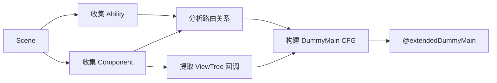

# 🚀 TypeScript Lifecycle - 鸿蒙生命周期建模框架

> **基于 ArkAnalyzer 的扩展版生命周期建模框架**
> 
> 本项目扩展了 ArkAnalyzer 的 `DummyMainCreater`，实现多 Ability 支持和精细化 UI 回调建模。

[](https://github.com/kemoisuki/typescript_lifecycle)

---

## 📦 项目结构

```
typescript/
├── README.md                           # 本文件（项目说明）
├── arkanalyzer-master/                 # ArkAnalyzer 源码
│   └── arkanalyzer-master/
│       └── src/
│           ├── core/                   # 核心模块
│           ├── callgraph/              # 调用图
│           └── TEST_lifecycle/         # ⭐ 新增：生命周期建模扩展
│               ├── README.md           # 详细文档
│               ├── LifecycleTypes.ts   # 类型定义
│               ├── AbilityCollector.ts # Ability/Component 收集
│               ├── NavigationAnalyzer.ts # 🆕 路由分析器
│               ├── ViewTreeCallbackExtractor.ts
│               ├── LifecycleModelCreator.ts
│               └── index.ts
├── FlowDroid-develop/                  # FlowDroid 参考实现
├── ArkAnalyzer文档.md                  # ArkAnalyzer 学习文档
└── 0109会议纪要.txt                    # 会议记录
```

---

## 🎯 项目目标

本项目旨在扩展 ArkAnalyzer 的 DummyMain 机制，实现：

| 功能 | 原版 | 扩展版 |
|------|:----:|:------:|
| 多 Ability 支持 | ❌ | ✅ |
| 页面跳转建模 | ❌ | ✅ 基础实现 |
| 精细化 UI 回调 | ❌ | ✅ |
| ViewTree 整合 | ❌ | ✅ |
| 可配置性 | ❌ | ✅ |

---

## 🚀 快速开始

### 使用扩展版 DummyMain

```typescript
import { Scene } from './arkanalyzer-master/arkanalyzer-master/src/Scene';
import { LifecycleModelCreator } from './arkanalyzer-master/arkanalyzer-master/src/TEST_lifecycle';

// 1. 构建 Scene
const scene = new Scene();
scene.buildSceneFromProjectDir('/path/to/harmonyos/project');

// 2. 创建扩展版 DummyMain
const creator = new LifecycleModelCreator(scene);
creator.create();

// 3. 获取结果
const dummyMain = creator.getDummyMain();
const abilities = creator.getAbilities();
const components = creator.getComponents();

// 4. 用于后续分析
const cfg = dummyMain.getCfg();
```

---

## 📖 核心模块说明

### TEST_lifecycle 模块

| 文件 | 功能 |
|------|------|
| `LifecycleTypes.ts` | 类型定义（Ability/Component 信息结构） |
| `AbilityCollector.ts` | 收集所有 Ability 和 Component，识别入口 |
| `NavigationAnalyzer.ts` | 🆕 路由分析（支持变量追踪和对象参数解析） |
| `ViewTreeCallbackExtractor.ts` | 从 ViewTree 提取 UI 回调 |
| `LifecycleModelCreator.ts` | 核心构建器，生成 DummyMain |
| `index.ts` | 模块入口 |

### 关键技术点

```
┌─────────────────────────────────────────────────────────────┐
│ ① 路由参数解析 (extractRouterUrl)                           │
│    router.pushUrl(options) → 追踪变量 → 提取 url 字段       │
├─────────────────────────────────────────────────────────────┤
│ ② Want 对象解析 (extractWantTarget)                         │
│    startAbility(want) → 追踪变量 → 提取 abilityName 字段    │
├─────────────────────────────────────────────────────────────┤
│ ③ 入口识别 (checkIsEntryAbility)                            │
│    读取 module.json5 → 解析 mainElement → 确定入口 Ability  │
├─────────────────────────────────────────────────────────────┤
│ ④ 回调方法解析 (resolveCallbackMethod)                      │
│    onClick(handler) → 解析 MethodSig/FieldRef → ArkMethod  │
├─────────────────────────────────────────────────────────────┤
│ ⑤ 生命周期参数生成 (addMethodInvocation)                    │
│    onCreate() → 生成 new Want() → onCreate(want) 完整调用  │
├─────────────────────────────────────────────────────────────┤
│ ⑥ UI 回调参数生成 (addUICallbackInvocation)                 │
│    handleClick() → 生成 new ClickEvent() → handleClick(e)  │
└─────────────────────────────────────────────────────────────┘
```

### 工作流程



---

## 📚 详细文档

👉 **[查看完整文档](arkanalyzer-master/arkanalyzer-master/src/TEST_lifecycle/README.md)**

文档包含：
- 背景与动机
- 核心概念详解（Ability、Component、ViewTree）
- 模块架构图
- 完整流程解析（含图解）
- 类与函数详解
- 使用示例
- TODO 与扩展点
- 常见问题

---

## 🔧 TODO

### 已完成 ✅
- [x] 实现 `NavigationAnalyzer` - 路由分析器（支持 loadContent/pushUrl/replaceUrl/startAbility）
- [x] 实现 `analyzeNavigationTargets()` - 页面跳转分析
- [x] 完善 `extractRouterUrl()` - 支持追踪变量定义和对象参数解析
- [x] 完善 `extractWantTarget()` - 解析 Want 对象获取目标 Ability
- [x] 实现 `checkIsEntryAbility()` - 从 module.json5 读取入口配置
- [x] 实现 `resolveCallbackMethod()` - 回调方法解析（支持 MethodSignature/FieldRef/Constant）
- [x] 实现 `addMethodInvocation()` - 自动生成生命周期方法参数（Want/WindowStage 等）
- [x] 实现 `addUICallbackInvocation()` - 自动生成 UI 回调参数（ClickEvent/TouchEvent 等）

### 可选扩展
- [ ] Lambda 完整支持 - 完整解析内联 Lambda 表达式
- [ ] 复杂路由参数解析 - 处理动态计算的路由参数

---

## 🧪 测试

### 测试结果

```
 Test Files  1 passed (1)
      Tests  17 passed (17)
   Duration  5.92s
```

### 测试覆盖

| 层级 | 测试内容 | 状态 |
|------|---------|:----:|
| L1 单元测试 | AbilityCollector, ViewTreeCallbackExtractor, NavigationAnalyzer | ✅ |
| L2 集成测试 | 模块间协作 | ✅ |
| L3 端到端测试 | 完整 DummyMain 生成 | ✅ |

### 运行测试

```bash
cd arkanalyzer-master/arkanalyzer-master
npm install                                          # 首次需要
npx vitest run tests/unit/lifecycle/ --reporter=verbose
```

详细测试说明见 `tests/resources/lifecycle/README.md`

---

## 👥 贡献者

- **YiZhou** - 项目负责人
- **AI Assistant** - 代码框架与文档

---

## 📅 更新日志

| 日期 | 版本 | 说明 |
|------|------|------|
| 2025-01-28 | v0.7.0 | 添加完整测试套件，17 项测试全部通过 |
| 2025-01-28 | v0.6.0 | 实现 addUICallbackInvocation() UI 回调参数生成 |
| 2025-01-28 | v0.5.0 | 实现 addMethodInvocation() 生命周期方法参数生成 |
| 2025-01-28 | v0.4.0 | 实现 resolveCallbackMethod() 回调方法解析 |
| 2025-01-27 | v0.3.0 | 完善路由参数解析和 module.json5 入口识别 |
| 2025-01-27 | v0.2.0 | 新增 NavigationAnalyzer 路由分析器 |
| 2025-01-17 | v0.1.0 | 初始框架完成，包含基本结构和文档 |

---

## 📄 许可证

本项目基于 Apache License 2.0 许可证。

---

> 如有问题，欢迎提 Issue 或 PR！
