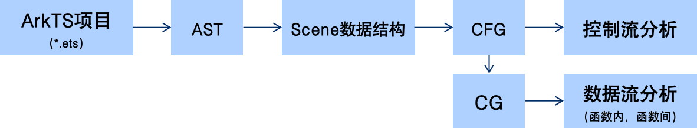
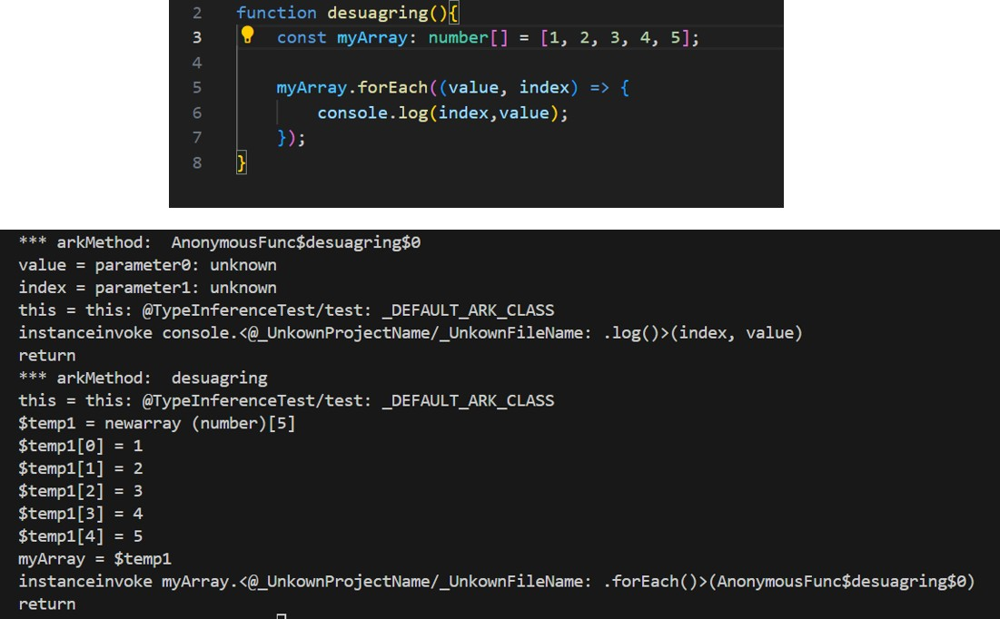
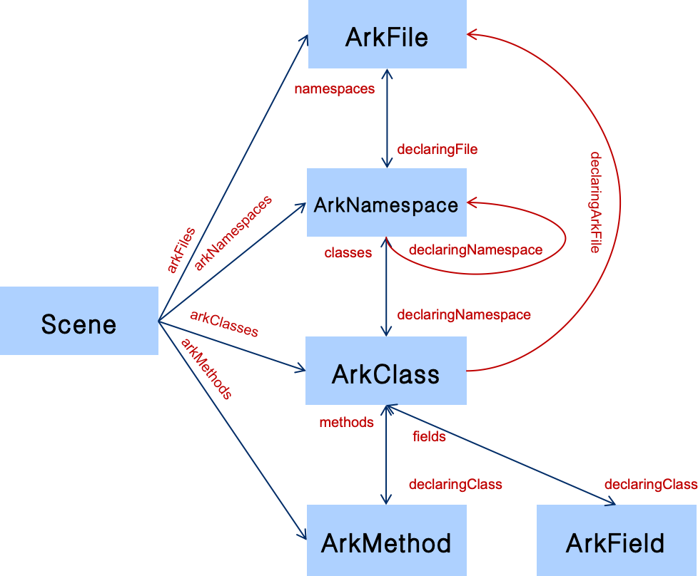

# ArkAnalyzer 快速入门指南

[TOC]

## 1 ArkAnalyzer 简介

ArkAnalyzer 是针对基于 ArkTS 语言开发的鸿蒙原生应用的静态代码分析框架。下图展示了其基本工作原理。目前，ArkAnalyzer 的输入为 ArkTS 文件（即后缀为 ets 的文件）。ArkAnalyzer 会先为 ArkTS代码生成一个抽象语法树（AST），接着遍历这颗语法树并生成一个 Scene数据结构。这个 Scene 数据结构对代码结构进行了抽象，用户可通过该数据结构快速获取 ArkTS 项目中某个具体的类、函数或者属性。接下来，ArkAnalyzer 为每一个函数生成一个控制流程图（CFG），用户可基于此图进行控制流相关的分析。基于 CFG，ArkAnalyzer 进一步实现方法调用图的生成（CG），并基于此支持用户实现数据流分析。



### 1.1 ArkAnalyzer-IR（三地址码）简介

临时变量命名规则
临时变量命名采用“$temp”+number 的形式，其中 number 为临时变量为所在的 CFG 中的临时变量序号。

代码简化（循环消减、去语法糖化）
源代码中的循环，包括 while，for，for of，for in 在 CFG 中全部改为代码块配合 if 语句的形式。

语法糖指编程语言中提供的一种简化或更加直观的语法结构，这种语法结构能够使得代码更加易读、易写，但并不增加新的语言功能。TS 中的语法糖包括匿名函数和对集合元素处理时用到的 for-each 函数等。在下图的例子中，myArray 是一个数组，使用 forEach 方法遍历数组，对于数组中的每个元素，都执行一个匿名函数。在下半可以看到方舟分析器将匿名函数显示定义出来，命名为 AnonymousFunc$desuagring$0，for-each 使用时直接调用。



### 1.2 Scene 数据结构

Scene 类为 ArkAnalyzer 的核心类，用户可以通过该类访问所分析代码（项目）的所有信息，包括文件列表、类列表、方法列表、属性列表等。Scene 类具体数据结构如下所示。



## 2 ArkAnalyzer 环境配置

使用 rollup 将 ArkAnalyzer 打包成单个文件bundle.js。使用bundle,js，package.json， tsconfig.json 可以运行 ArkAnalyzer 的所有功能。

配置文件结构如下：

```console
ArkAnalyzer
    |---bundle.js
    |---package.json
    |---tsconfig.json
```

下载解压配置文件夹后首先运行 npm install 命令获取必要的TS 库。使用 SceneConfig 类构建项目，样例如下：

```typescript
import { SceneConfig, Scene } from "./bundle";
const config_path = "tests/example.json";
let config: SceneConfig = new SceneConfig();
config.buildFromJson(config_path);
let scene: Scene = new Scene(config);
```

构建项目需要json 文件，包含了待测试代码所在位置等基本信息，样例如下（注：真实的 json 文件中不能含有注释）：
```json
{
  "targetProjectName": "Example",//项目名称
  "targetProjectDirectory": "tests/resources/example",//项目所在位置路径
  "ohosSdkPath": "",//ohos sdk api 路径，项目不包含 ohos api 时为空
  "kitSdkPath": "",//ohos 套件 api 路径，项目不包含 ohos api 时为空
  "systemSdkPath": "",//系统 sdk 路径，项目不包含 ohos api 时为空
  "otherSdks": []//其他 sdk，一般为空
}
```

## 3 ArkAnalyzer 使用样例

### 3.1 基本功能（ex01)

下面将以以下项目为例，说明 ArkAnalyzer 基本功能的使用方法。

**项目示例**

项目结构：
```console
demo_project/src
    |---models
    |	|---books.ts
    |---services
    |	|---bookService.ts
    |---index.ts
```

示例文件内容：

books.ts
```typescript
export namespace Library {
    export class Book {
        public title: string;
        public author: string;
        constructor(title: string,author: string) {
            this.title = title;
            this.author = author;
        }
    }
}
```

bookService.ts
```typescript
import { Library } from "../models/book";

export class BookService {
    private books: Library.Book[] = [];
    
    public addBook(book: Library.Book): void {
        this.books.push(book);
    }
    
    public getAllBooks(): Library.Book[] {
        return this.books;
    }
}
```

index.ts
```typescript
import { Library } from "./models/book";
import { BookService } from "./services/bookService";

const bookService = new BookService();
bookService.addBook(new Library.Book("The Hobbit", "J.R.R. Tolkien"));
const books = bookService.getAllBooks();
console.log(books);
```

**ex01.1：获取所有文件**

为获取项目中所有的文件，我们使用 Scene 类的getFiles() 方法。以下是示例代码和输出。

basicUsage.ts
```typescript
let files: ArkFile[] = scene.getFiles();
let fileNames: string[] = files.map(file => file.name); console.log(fileNames);
```

输出
```console
[
  'src/index.ts',
  'src/models/book.ts',
  'src/services/bookService.ts'
]
```

**ex01.2：获取命名空间**

为获取项目中定义的所有命名空间，我们使用Scene 类的getNamespaces() 方法。以下是示例代码和输出。

basicUsage.ts
```typescript
let namespaces: ArkNamespace[] = scene.getNamespaces();
let namespaceNames: string[] = namespaces.map(ns => ns.name); console.log(namespaceNames);
```

输出
```console
[ 'Library' ]
```

此外，也可以从ArkFile 中获取该文件下的所有命名空间，我们使用ArkFile 类的 getNamespaces() 方法。以下是示例代码和输出。

basicUsage.ts
```typescript
let namespaces2: ArkNamespace[] = files[1].getNamespaces(); let namespaceNames2: string[] = namespaces2.map(ns => ns.name); console.log(namespaceNames2);
```

输出
```console
[ 'Library' ]
```

**ex01.3：获取所有类**

要获取项目中定义的所有类，我们使用Scene 类的 getClasses() 方法。以下是示例代码和输出。

basicUsage.ts
```typescript
let classes: ArkClass[] = scene.getClasses();
let classNames: string[] = classes.map(cls => cls.name); console.log(classNames);
```

输出
```console
[
  '_DEFAULT_ARK_CLASS',
  '_DEFAULT_ARK_CLASS',
  '_DEFAULT_ARK_CLASS',
  'Book',
  '_DEFAULT_ARK_CLASS',
  'BookService'
]
```
说明：ArkAnalyzer 会为每一个文件和命名空间分别创建一个默认类，记为_DEFAULT_ARK_CLASS。

同样，也可以从 ArkFile 中获取该文件下的所有类，我们使用 ArkFile 类的 getClasses() 方法。以下是示例代码和输出。

basicUsage.ts
```typescript
let classes2: ArkClass[] = files[2].getClasses();
let classNames2: string[] = classes2.map(cls => cls.name); console.log(classNames2);
```

输出
```console
[ '_DEFAULT_ARK_CLASS', 'BookService' ]
```

当然，我们也可以从ArkNamespace 中获取该命名空间下的所有类，我们使用 ArkNamespace 类的 getClasses() 方法。以下是示例代码和输出。

basicUsage.ts
```typescript
let classes3: ArkClass[] = namespaces[0].getClasses();
let classNames3: string[] = classes3.map(cls => cls.name); console.log(classNames3);
```

输出
```console
[ '_DEFAULT_ARK_CLASS', 'Book' ]
```

**ex01.4：获取所有属性**

为获取特定类中定义的所有属性，我们首先需要获取该类的ArkClass，然后调用其 getFields() 方法。以下是示例代码和输出。

basicUsage.ts
```typescript
let bookClass: ArkClass = classes[3];
let fields: ArkField[] = bookClass.getFields();
let fieldNames: string[] = fields.map(fld => fld.name); console.log(fieldNames);
```

输出
```console
[ 'title', 'author' ]
```

**ex01.5：获取所有方法**

为获取特定类中定义的所有方法，我们首先需要获取该类的ArkClass，然后调用其 getMethods() 方法。以下是示例代码和输出。

basicUsage.ts
```typescript
let serviceClass: ArkClass = classes[5];
let methods: ArkMethod[] = serviceClass.getMethods();
let methodNames: string[] = methods.map(mthd => mthd.name); console.log(methodNames);
```

输出
```console
[ 'addBook', 'getAllBooks' ]
```

同样的，也可以从 Scene 中获取其内部的全部方法，示例如下。

basicUsage.ts
```typescript
let methods1: ArkMethod[] = scene.getMethods();
let methodNames1: string[] = methods1.map(mthd => mthd.name); console.log(methodNames1);
```

输出
```console
[
  '_DEFAULT_ARK_METHOD',
  '_DEFAULT_ARK_METHOD',
  '_DEFAULT_ARK_METHOD',
  'constructor',
  '_DEFAULT_ARK_METHOD',
  'addBook',
  'getAllBooks'
]
```

说明：与ArkClass 类似，ArkAnalyzer 会为每一个文件和命名空间分别创建一个默认方法，记为_DEFAULT_ARK_METHOD 。

**ex01.6：获取方法 CFG**

通过 ArkMethod 的getBody()方法获取方法体，再通过getCfg()方法可以获取方法的CFG，示例如下所示。
```typescript
let methods: ArkMethod[] = scene.getMethods();
let methodCfg: Cfg = methods[0].getBody().getCfg();
```

下面我们简要介绍 ArkAnalyzer 中 CFG 的数据结构设计。

属性：
* blocks：一个 Set<BasicBlock> 集合，存储了图中所有的基本块。
* stmtToBlock：一个 Map<Stmt, BasicBlock> 映射，关联每个语句（Stmt）到它所属的基本块。
* startingStmt：表示图中的起始语句。这个起始语句用于标识控制流图的入口点。 defUseChains：存储定义-使用链的数组。
* declaringMethod：存储声明了这个 CFG 的方法。
* declaringClass：存储声明了这个 CFG 的类。

方法：
* getStmts：遍历所有基本块，收集并返回图中所有的语句。
* getBlocks、getStartingBlock、getStartingStmt 提供了获取基本块集合、起始块和起始语句的方法。
* getDefUseChains：返回定义-使用链的集合。

此外，为了便于更直观理解 CFG 结构，ArkAnalyzer 提供 PrinterBuilder 类。 PrinterBuilder 类的 dumpToDot()方法以ArkFile 为单位，对于一个文件中的每个 ArkMethod 生成Dot 图对将 CFG 可视化。示例如下所示。
```typescript
let scene: Scene = new Scene(config);
let files: ArkFile[] = scene.getFiles();
for ( const arkFile of files ) {
    let printer = new PrinterBuilder();
    printer.dumpToDot(arkFile);
}
```

dumpToDot()方法输出ArkFile 对应的.dot 文件，可以通过 Graphviz Online 平台将.dot 文件识别为 Dot 图。例如对于以下方法
```typescript
function f(): number {
    let i = 0;
    for ( i = 0; i < 10; i++) {
        if (i < 5) {
            i+=2;
        }
    }
    return i;
}
```

转化为 Dot 图如下：


### 3.2 控制流分析（ex02）

ArkAnalyzer 生成的方法调用图是局部代码的方法调用图，构建时需要指定分析的起始点。方法调用图会从该起始点开始进行 bfs，打印出所有相关的调用关系。

以下面的代码文件作为测试用例，分别使用三种算法进行方法调用图生成
```typescript
abstract class Animal {
    sound(): void {}
}
class Dog extends Animal {
    sound(): void {}
}
class Cat extends Animal{
    sound(): void {}
}

function main() {
    makeSound(new Dog())
}

function makeSound(animal: Animal) {
    animal.sound()
}
```

通过下面的方式指定分析入口点函数，并对项目所有代码进行类型推导
```typescript
// 加入需要进行分析的方法签名,method 是文件中默认类下 main 方法
let methodSignature = method.getSignature()
let entryPoints: MethodSignature[] = [methodSignature]
// 进行类型推导
projectScene.inferTypes()
```

**ex02.1：打印函数调用图（CHA）**

```typescript
// 调用 CHA 算法
let callGraph = projectScene.makeCallGraphCHA(entryPoints)
// 获取输出
let methods = callGraph.getMethods() let calls = callGraph.getCalls()
// 对方法调用图中的节点及边进行打印
printCallGraphDetails(methods, calls, "root_directory")
```

输出
```typescript
Methods:
  @Media/example: _DEFAULT_ARK_CLASS.main()
  @Media/example: _DEFAULT_ARK_CLASS.makeSound(Animal)
  @Media/example: Dog.sound()
  @Media/example: Cat.sound()
Calls:
  <@Media/example: _DEFAULT_ARK_CLASS.main() ->
    <@Media/example:_DEFAULT_ARK_CLASS.makeSound(Animal)

  <@Media/example: _DEFAULT_ARK_CLASS.makeSound(Animal) ->
    <@Media/example: Dog.sound()
    <@Media/example: Cat.sound()
```

**ex02.2：打印函数调用图（RTA）**

```typescript
// 调用 RTA 算法
let callGraph = projectScene.makeCallGraphRTA(entryPoints)
// 获取输出
let methods = callGraph.getMethods()
let calls = callGraph.getCalls()
// 对方法调用图中的节点及边进行打印
printCallGraphDetails(methods, calls, "root_directory")
```

输出
```typescript
Methods:
  @Media/example: _DEFAULT_ARK_CLASS.main() 
  @Media/example: _DEFAULT_ARK_CLASS.makeSound(Animal)
  @Media/example: Dog.sound()
  @Media/example: Cat.sound()
Calls:
  <@Media/example: _DEFAULT_ARK_CLASS.main() ->
     <@Media/example:_DEFAULT_ARK_CLASS.makeSound(Animal)

  <@Media/example: _DEFAULT_ARK_CLASS.makeSound(Animal)	->
    <@Media/example: Dog.sound()
```

**ex02.3：打印函数调用图（PTA）**

```typescript
// 调用 RTA 算法
let callGraph = projectScene.makeCallGraphVPA(entryPoints) let methods = callGraph.getMethods() // 在指针分析中暂时不需要使用 method，因此可能会出现该集合不全
let calls = callGraph.getCalls()
printCallGraphDetails(methods, calls, config.getTargetProjectDirectory())
```

输出
```typescript
Calls:
  <@project/example: _DEFAULT_ARK_CLASS.main() ->
    <@project/example:_DEFAULT_ARK_CLASS.makeSound(Animal)

  <@project/example: _DEFAULT_ARK_CLASS.makeSound(Animal) ->
    <@project/example: Dog.sound()
```

**ex02.4：找到所有 Log 点**

在这个实验中我们用一个简单的自定义的log 类模拟日志打印

log.ts
```typescript
export class Logger {
public static info(message: string) {
    console.log(message)
}
public static warn(message: string) {
    console.log(message)
}
public static error(message: string) {
    console.log(message)
}
}
```

basicUsage.ts
```typescript
import { Logger } from "./log"
abstract class Animal {
    sound(): void { }
}
class Dog extends Animal {
    sound(): void {
        Logger.warn("dog sound")
    }
}
class Cat extends Animal {
    sound(): void {
        Logger.error("dog sound")
    }
}
function main() {
    makeSound(new Dog())
    Logger.info("create new dog")
}
function makeSound(animal: Animal) {
    animal.sound()
}
```

通过上述方法生成方法调用图（这里以 CHA 为例），得到下面的结果
```console
Calls:
<@project/main2: _DEFAULT_ARK_CLASS.main() ->
  <@project/main2:_DEFAULT_ARK_CLASS.makeSound(Animal)
  <@project/log: Logger.info(string)

<@project/main2: _DEFAULT_ARK_CLASS.makeSound(Animal) ->
  <@project/main2: Dog.sound()
  <@project/main2: Cat.sound()

<@project/main2: Dog.sound() ->
  <@project/log: Logger.warn(string)

<@project/main2: Cat.sound() ->
  <@project/log: Logger.error(string)
```

**ex02.5：打印Import 关系**

### 3.3 函数内数据流分析（ex03）

**ex03.1：SSA 观察**

获取 scene 后，可对 scene 下的所有方法进行 SSA 处理，处理前需要使用inferType（）函数进行类型推导，SSA 处理代码示例如下
```typescript
const scene: Scene;
scene.inferTypes();
let staticSingleAssignmentFormer = new StaticSingleAssignmentFormer();
...
const arkMethod: ArkMethod;
const body = arkMethod.getBody();
staticSingleAssignmentFormer.transformBody(body);
```

**ex03.2：理解Def-Use Chain**

获取指定的 ArkMethod 后，可通过如下方式获取 Def-Use Chain。每个 chain 有三个属性，分别是 value（变量），def（定义语句），use（使用语句）。需要注意的是，Def-Use Chain 只适用于函数内的局部变量分析，不能分析对象属性和数组。
```typescript
const arkMethod: ArkMethod;
const cfg = arkMethod.getBody().getCfg();
cfg.buildDefUseChain();
const chains = cfg.getDefUseChains()
```

**ex03.3：规则检测示例**

在 TS 中，exec 函数可以直接执行命令，因此需要检查 exec 函数的参数是否有例如“rm -rf /bin”之类的会对计算机带来不可逆损害的命令。下面的示例代码为：获取指定 ArkMethod 后，逐句检查是否有exec 函数调用，如果有则输出参数。
```typescript
const arkMethod: ArkMethod;
const cfg = arkMethod.getCfg();
for (const stmt of cfg.getStmts()) {
    if (stmt.getExprs().length > 0) {
        const expr = stmt.getExprs()[0];
        if (expr instanceof ArkStaticInvokeExpr && 
            expr.getMethodSignature()
                .getMethodSubSignature()
                .getMethodName() == "exec") {
            const args = expr.getArgs();
            console.log(args);
        }
    }
}
```

### 3.4 函数间数据流分析（ex04）

**ex04.1: 空指针检测**

空指针分析可以检查代码是否存在程序试图使用空指针（即指向不存在对象的指针）时，导致程序崩溃或出现未定义的行为。例如程序用到了 a.b，如果 a 为 undefined 或者 null 会导致程序崩溃。下面的代码演示了如何对程序进行空指针分析，入口函数为第一个文件的“U2”，检测从这个函数开始到结束是否有空指针的属性调用。
```typescript
const config_path = resources/UndefinedVariable/UndefinedVariable.json";
const scene = new Scene(config);
const defaultMethod = scene.getFiles()[0]
                           .getDefaultClass()
                           .getDefaultArkMethod();
const method = ModelUtils.getMethodWithName("U2",defaultMethod!);
if(method) {
    let len = method.getParameters().length;
    const problem = new UndefinedVariableChecker(
        [...method.getCfg().getBlocks()][0].getStmts()[len], method);
    const solver = new UndefinedVariableSolver(problem, scene);
    solver.solve();
}
```
